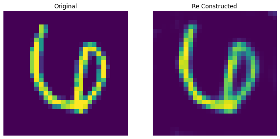

### Image Search Using Autoencoders In MNIST Dataset 🔍

**example**
___


___

Run Using

```bash
python3 app.py
```
Then open http://localhost:8080 on your browser.

>  Search engine architecture uses a auto encoder to encode images into a 128-D vectors and clusters them using KMeans.

> When querying an image image is fed into the autoencoder which returns a 128-D vector, the vector is used to find which cluster the image belongs to and then some of the images from the cluster are fetched as result.


### Auto-Encoders Used In Search Engine

1. **Dense Autoencoder**

    

2. **Convolutional Autoencoder**

    

3. **Convolutional Autoencoder With Perceptual Loss** 

    

### Using different auto encoders for search

> Just open the app.py and find below code.

```python
search = DenseAutoEncoderSearch()
```

> and replace it with one of the following.

```python
search = ConvolutionalAutoEncoderSearch()
#or
search = ConvolutionalAutoEncoderWithPerceptLossSearch()
```

* UI is build in node using ReactJS⚛️ 